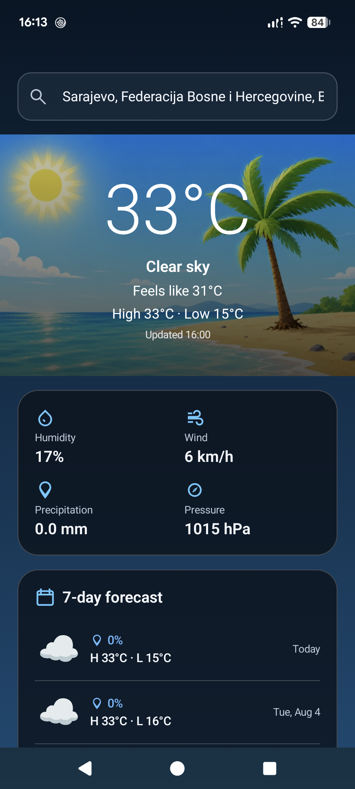
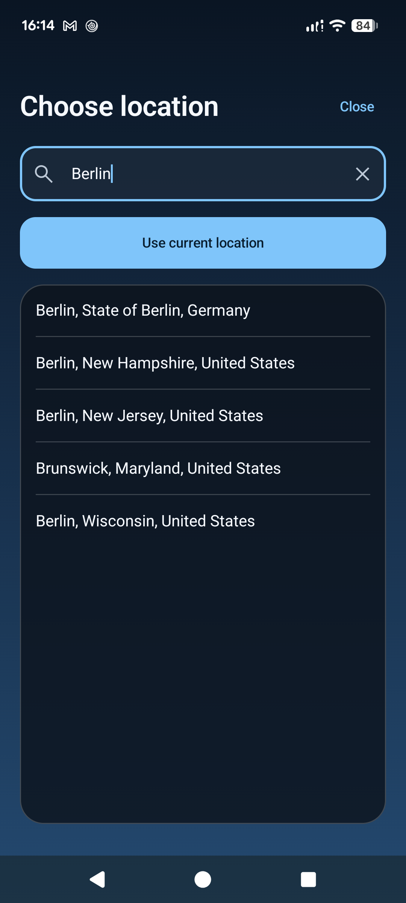
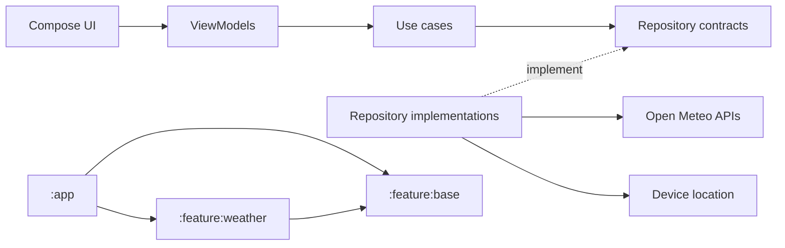

<p align="center">
  
</p>

# GoodTimes

GoodTimes is a weather forecast application that provides current conditions and a seven day forecast for the device location or a city selected by the user.

| Current weather and forecast | Location search |
| :---: | :---: |
|  |  |

## Features

| Requirement | Implementation |
| --- | --- |
| Current day forecast | Current temperature, apparent temperature, high and low temperatures, condition, humidity, wind, precipitation, pressure, and update time |
| Weekly forecast | Seven day forecast with conditions, precipitation probability, and temperature range |
| Current city | Approximate device location resolved through Google Play Services and Android geocoding |
| Another city | Debounced Open Meteo location search with explicit city selection |

Location permission is optional. If it is unavailable or denied, the user can continue by searching for a city.

## Architecture

The project follows Clean Architecture within a modular Android application.



- `:app` owns the application entry point, top level navigation, network clients, and dependency composition.
- `:feature:weather` contains the weather presentation, domain, and data layers.
- `:feature:base` provides shared UI, navigation, result, and Retrofit primitives.

Presentation depends on use cases, data implementations satisfy domain repository contracts, and network DTOs are mapped at the data boundary. Koin assembles these dependencies without exposing infrastructure types to the domain layer.

## Technical choices

- Kotlin, Coroutines, and Flow for asynchronous state and request coordination
- Jetpack Compose and Material 3 for the complete user interface
- Navigation Compose with typed destinations and an explicit location result contract
- Koin for dependency injection
- Retrofit, OkHttp, and Kotlin Serialization for forecast and geocoding requests
- Google Play Services Location for approximate device coordinates
- Open Meteo for weather forecasts and city search without an API key
- JUnit, Detekt, and Spotless for behavioral checks and source quality

The app also includes edge to edge layouts, localized dates and values, accessibility semantics, pull to refresh, stale request protection, and reduced motion handling.

## Getting started

### Requirements

- Android Studio with JDK 17
- Android SDK 37
- Android 7.0 or newer device or emulator

### Run the app

```shell
git clone https://github.com/IvanSimovic/GoodTimes.git
cd GoodTimes
./gradlew :app:assembleDebug
```

Open the project in Android Studio and run the `debug` variant. No API key or local configuration is required. Grant approximate location access to load the device location, or choose a city manually.

### Optional release signing

Release artifacts can be built without repository credentials. To install a locally signed release variant from Android Studio, create an ignored `keystore.properties` file in the project root:

```properties
storeFile=path/to/your/keystore.jks
storePassword=your_store_password
keyAlias=your_key_alias
keyPassword=your_key_password
```

## Verification

```shell
./gradlew testDebugUnitTest
./gradlew detektCheck
./gradlew spotlessCheck
./gradlew :app:assembleRelease
```

The JVM test suite covers ViewModel state transitions, use cases, API and presentation mapping, date formatting, navigation result serialization, and weather artwork behavior. The main current location and city selection flows were also manually validated with an optimized release build on a Pixel 7.

Automated Compose UI tests are not currently included.

## Deliberate scope

- Forecasts require a network connection and are not persisted for offline use.
- Only approximate location permission is requested.
- Release builds enable code shrinking, resource shrinking, and obfuscation, with consumer rules for types inspected by Retrofit.
- Backup and device transfer are disabled because the app stores no user data.
- Cleartext network traffic is disabled.

## Attribution

Weather and geocoding data are provided by [Open Meteo](https://open-meteo.com/).

This project is available under the [MIT License](LICENSE). See [AI assistance](AI_ASSISTANCE.md) for details about the development tooling.
